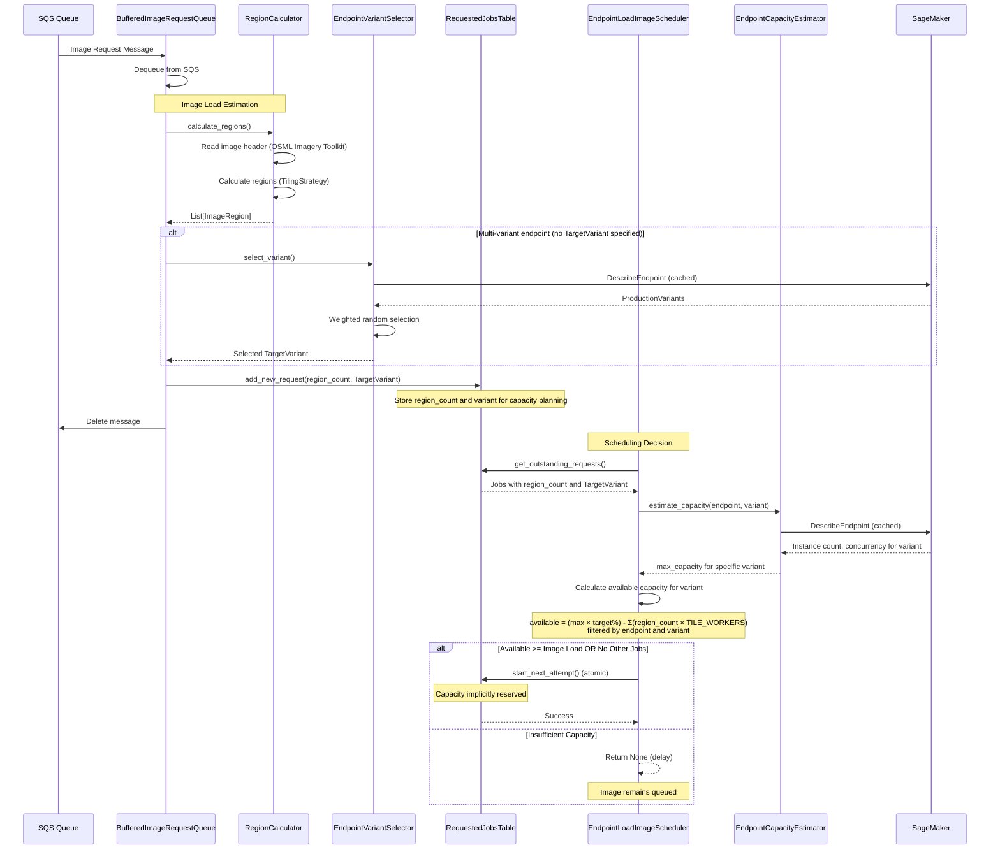
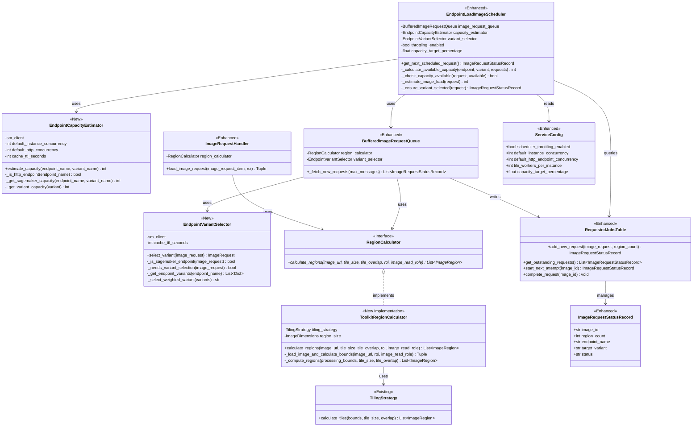

# Design Document

## Overview

This design implements proactive, image-level throttling in the ModelRunner scheduler to prevent endpoint overload before it occurs. Instead of reactively throttling individual regions during processing, the scheduler compares unused endpoint capacity to estimated image load to decide whether an image should start processing.

The key insight is to shift from region-based reactive throttling to image-based proactive throttling, checking capacity at scheduling time rather than during region processing. This prevents jobs from starting that cannot be completed, reduces system complexity by eliminating the DynamoDB-based region tracking, and provides more accurate capacity management using model-specific configurations.

## Architecture

### Integration with Existing Components

This design extends the existing `EndpointLoadImageScheduler` rather than replacing it. The current scheduler already:
- Manages image request prioritization via `BufferedImageRequestQueue`
- Tracks job status via `RequestedJobsTable` (DynamoDB)
- Calculates endpoint utilization based on region counts
- Queries SageMaker for instance counts

We will enhance this scheduler with capacity-based throttling that:
- Estimates image load in tile units before scheduling
- Only starts images that the endpoint has capacity to handle
- Supports both SageMaker and HTTP endpoints
- Provides capacity calculations for both serverless and instance-backed endpoints

### High-Level Flow



### Component Interactions

1. **EndpointLoadImageScheduler** (existing, enhanced): Orchestrates scheduling with capacity checks
2. **EndpointCapacityEstimator** (new): Calculates endpoint capacity from SageMaker/HTTP metadata
3. **EndpointVariantSelector** (new): Selects endpoint variants using weighted random selection for multi-variant endpoints
4. **RegionCalculator** (new interface): Defines contract for calculating regions
5. **ToolkitRegionCalculator** (new implementation): Calculates regions using osml-imagery-toolkit and TilingStrategy
6. **TilingStrategy** (existing, reused): Provides region calculations
7. **RequestedJobsTable** (existing, enhanced): Tracks region_count per job for capacity calculation
8. **BufferedImageRequestQueue** (existing, enhanced): Calculates regions during buffering, stores count
9. **ImageRequestHandler** (existing, enhanced): Uses RegionCalculator for consistent region calculation

**Key Insight**: No separate capacity tracking is needed! The RequestedJobsTable already tracks all in-progress jobs with their region_count. The scheduler can estimate load on-the-fly (region_count × TILE_WORKERS_PER_INSTANCE) and sums them to get current utilization. The atomic `start_next_attempt()` conditional update prevents race conditions. This avoids race conditions that exist in the older region throttling implementation.

### Key Design Decisions

**Decision 1: Extend Existing Scheduler, Don't Replace**
- Rationale: Preserve existing load-balancing logic and request prioritization
- Trade-off: More complex integration but maintains backward compatibility

**Decision 2: Throttle at Image Level, Not Region Level**
- Rationale: Prevents partial job execution and failures mid-processing
- Trade-off: Adds image header read during scheduling, but enables fail-fast for inaccessible images

**Decision 3: Use Tile-Based Capacity Units**
- Rationale: Aligns with actual endpoint load (concurrent inference requests)
- Trade-off: More accurate than region-based counting, easier to reason about

**Decision 4: Allow Single Image Exception**
- Rationale: Prevents deadlock when image load exceeds total endpoint capacity
- Trade-off: Single large image can still overload endpoint, but system makes progress

**Decision 5: Support HTTP, Multi-Variant, and Serverless Endpoints**
- Rationale: System already supports HTTP, Multi-Variant, and Serverless endpoints, throttling should too
- Trade-off: Requires more complex capacity calculations with defaults

**Decision 6: Remove Older Throttling of In-Progress Jobs**
- Rationale: Eliminates complexity, race conditions, and infrastructure dependency
- Trade-off: None - scheduler-based approach is strictly better

**Decision 7: Support Configurable Target Capacity**
- Rationale: Allows operators to maintain headroom for autoscaling and burst traffic
- Trade-off: Configuration option that must be tuned by operators in a live system
- Use Cases:
  - Set to 0.8 (80%) to maintain headroom for other requests to the endpoint
  - Set to 1.0 (100%) for maximum utilization in stable environments (default)
  - Set to 1.2 (120%) to allow the scheduler to overprovision endpoints in systems with agressive scaling

## Components and Interfaces

### Architecture Overview

The following class diagram illustrates the key components participating in capacity-based throttling and their relationships:



**Legend**:
- **`<<New>>`**: Newly created components for this feature
- **`<<Enhanced>>`**: Existing components with new functionality
- **`<<Existing>>`**: Existing components reused without modification
- **`<<Interface>>`**: Abstract interface defining a contract

**Key Relationships**:
- `EndpointLoadImageScheduler` orchestrates scheduling decisions using capacity estimation
- `EndpointCapacityEstimator` calculates endpoint capacity from SageMaker/HTTP metadata
- `EndpointVariantSelector` performs weighted random variant selection in BufferedImageRequestQueue
- `RegionCalculator` interface defines the contract for region calculation
- `ToolkitRegionCalculator` implements region calculation using GDAL and TilingStrategy
- `BufferedImageRequestQueue` uses RegionCalculator for fail-fast validation, stores region_count, and selects variants
- `ImageRequestHandler` uses RegionCalculator for consistent region calculation during processing
- `RequestedJobsTable` tracks region_count for capacity planning

### EndpointLoadImageScheduler (Enhanced)

**Purpose**: Existing scheduler enhanced with capacity-based throttling

**Location**: `src/aws/osml/model_runner/scheduler/endpoint_load_image_scheduler.py`

**New Methods**:
```python
class EndpointLoadImageScheduler(ImageScheduler):
    def __init__(
        self,
        image_request_queue: BufferedImageRequestQueue,
        capacity_estimator: Optional[EndpointCapacityEstimator] = None,
        throttling_enabled: bool = True,
        capacity_target_percentage: float = 1.0
    ):
        """
        Initialize with optional throttling components.
        
        :param capacity_estimator: Calculates endpoint capacity for throttling decisions
        :param capacity_target_percentage: Target utilization percentage (0.0-1.0).
                                          Values < 1.0 reserve headroom for autoscaling.
        
        Note: Variant selection is NOT needed here - it already happened in BufferedImageRequestQueue.
        By the time scheduler sees a request, TargetVariant is already set.
        """
        pass
    
    def _calculate_available_capacity(
        self,
        endpoint_name: str,
        variant_name: Optional[str],
        outstanding_requests: List[ImageRequestStatusRecord]
    ) -> int:
        """
        Calculate available capacity for a specific endpoint variant.
        
        Steps:
        1. Get max capacity for the specific variant from EndpointCapacityEstimator
        2. Apply capacity_target_percentage to get target capacity
        3. Sum estimated_load for all in-progress jobs targeting this specific variant
        4. Return target_capacity - sum_of_loads
        
        Args:
            endpoint_name: Name of the endpoint
            variant_name: Specific variant to calculate capacity for (None for HTTP endpoints)
            outstanding_requests: All outstanding requests to filter by variant
        
        The capacity_target_percentage allows planning for over or under 100% utilization,
        which is useful for:
        - Triggering autoscaling before hitting hard limits
        - Maintaining headroom for burst traffic
        - Reducing latency by avoiding queue buildup at endpoints
        """
        pass
    
    def _check_capacity_available(
        self,
        request: ImageRequestStatusRecord,
        available_capacity: int
    ) -> bool:
        """
        Check if sufficient capacity exists for this image.
        
        Returns:
            True if image can be scheduled, False if should be delayed
            
        Special case: If no other jobs are running for this endpoint,
        allow the image even if it exceeds capacity (prevents deadlock).
        """
        pass
    
    def _estimate_image_load(
        self,
        request: ImageRequestStatusRecord
    ) -> int:
        """
        Calculate load for an image request from its region count.
        
        Returns region_count × TILE_WORKERS_PER_INSTANCE.
        If region_count is None, returns a default of 20 regions x TILE_WORKERS_PER_INSTANCE.
        """
        pass
```

**Integration Points**:
- Enhance `get_next_scheduled_request()` with the following flow:
  1. Extract TargetVariant from request (already set by BufferedImageRequestQueue)
  2. Calculate capacity for the specific variant (not all variants combined)
  3. Check if sufficient capacity exists for this image on this variant
  4. If yes, call `start_next_attempt()` to atomically reserve capacity
- Capacity is atomically "reserved" when `start_next_attempt()` succeeds
- Capacity is automatically "released" when job completes (existing `complete_request()`)
- Reuse existing `_is_http_endpoint()` method
- Maintain existing load-balancing logic

**Capacity Calculation**:
The scheduler calculates available capacity by:
1. Extract TargetVariant from request (already set by BufferedImageRequestQueue)
2. Call _calculate_available_capacity(endpoint_name, variant_name, outstanding_requests) which:
   - Queries endpoint max capacity for the specific variant (via EndpointCapacityEstimator)
   - Filters outstanding_requests to only those targeting the same endpoint and variant
   - For each matching job, calculates estimated_load = region_count × TILE_WORKERS_PER_INSTANCE
   - Sums estimated loads for all jobs targeting that specific variant
   - Returns: ( variant max capacity * capacity target ) - sum of estimated loads for that variant
3. If available >= new image load, start the job (atomically via start_next_attempt)

**Key Design Decision**: We calculate `region_count` once when the request is added (fail-fast for inaccessible images) but calculate `estimated_load` on-demand during each scheduling cycle. This avoids:
- Race conditions from multiple schedulers updating the same DDB record
- Complexity of persisting and updating estimated_load
- The need to handle cases where TILE_WORKERS_PER_INSTANCE changes

The calculation `estimated_load = region_count × TILE_WORKERS_PER_INSTANCE` is fast and can be done on every scheduling cycle without performance concerns.

**Key Insight**: Capacity is implicitly "reserved" when `start_next_attempt()` succeeds (atomic DynamoDB conditional update). Capacity is implicitly "released" when `complete_request()` removes the job. No separate reserve/release calls needed!

### EndpointCapacityEstimator (New)

**Purpose**: Calculate maximum concurrent requests an endpoint can handle

**Location**: `src/aws/osml/model_runner/scheduler/endpoint_capacity_estimator.py` (new file)

**Interface**:
```python
class EndpointCapacityEstimator:
    def __init__(
        self,
        sm_client,
        default_instance_concurrency: int = 2,
        default_http_concurrency: int = 10,
        cache_ttl_seconds: int = 300
    ):
        """Initialize with SageMaker client and configuration."""
        pass
    
    def estimate_capacity(
        self,
        endpoint_name: str,
        variant_name: Optional[str] = None
    ) -> int:
        """
        Calculate endpoint capacity in concurrent inference requests.
        
        Args:
            endpoint_name: Name of SageMaker endpoint or HTTP URL
            variant_name: Specific variant to calculate capacity for.
                         If None, returns capacity for all variants combined.
                         For capacity-based throttling, this should always be specified
                         to get capacity for the selected variant.
            
        Returns:
            Maximum concurrent inference requests the endpoint/variant can handle
        """
        pass
    
    def _is_http_endpoint(self, endpoint_name: str) -> bool:
        """Check if endpoint is HTTP (not SageMaker)."""
        pass
    
    def _get_sagemaker_capacity(
        self,
        endpoint_name: str,
        variant_name: Optional[str]
    ) -> int:
        """Query SageMaker for capacity."""
        pass
    
    def _get_variant_capacity(self, variant: Dict) -> int:
        """Calculate capacity for a single variant."""
        pass
```

**Implementation Details**:
- For HTTP endpoints: return `DEFAULT_HTTP_ENDPOINT_CONCURRENCY` (variant_name ignored)
- For SageMaker endpoints:
  - If variant_name specified: return capacity for that specific variant only
  - If variant_name is None: return combined capacity for all variants
- For SageMaker serverless variants: return `MaxConcurrency` from the specific variant
- For SageMaker instance-backed variants:
  - Check for `osml:instance-concurrency` tag on endpoint
  - Multiply tag value (or DEFAULT_INSTANCE_CONCURRENCY) by CurrentInstanceCount for that variant
- Cache endpoint metadata with TTL to minimize API calls
- **Key Point**: For capacity-based throttling, always pass the specific variant_name to get accurate capacity for that variant

### EndpointVariantSelector (New)

**Purpose**: Select appropriate endpoint variants for SageMaker endpoints using weighted random selection

**Location**: `src/aws/osml/model_runner/scheduler/endpoint_variant_selector.py` (new file in scheduler package)

**Design Pattern**: Strategy Pattern - encapsulates variant selection logic and can be injected into components that need it

**Interface**:
```python
class EndpointVariantSelector:
    def __init__(
        self,
        sm_client,
        cache_ttl_seconds: int = 300
    ):
        """Initialize with SageMaker client and configuration."""
        pass
    
    def select_variant(
        self,
        image_request: ImageRequest
    ) -> ImageRequest:
        """
        Select an endpoint variant for the ImageRequest if not already specified.
        
        Logic:
        1. If TargetVariant is already set → return request unchanged (always honor explicit variant)
        2. If TargetVariant is not set and this is a SageMaker endpoint:
           - Query endpoint configuration to get ProductionVariants
           - Use weighted random selection based on CurrentWeight (same logic as existing set_default_model_endpoint_variant)
           - Set TargetVariant in model_endpoint_parameters
        3. For HTTP endpoints → return request unchanged (no variants)
        
        Args:
            image_request: The image request to process
            
        Returns:
            ImageRequest with TargetVariant set if selection was needed
        """
        pass
    
    def _is_sagemaker_endpoint(self, image_request: ImageRequest) -> bool:
        """Check if request uses SageMaker endpoint."""
        pass
    
    def _needs_variant_selection(self, image_request: ImageRequest) -> bool:
        """Check if variant selection is needed."""
        pass
    
    def _get_endpoint_variants(self, endpoint_name: str) -> List[Dict]:
        """Get ProductionVariants from SageMaker (cached)."""
        pass
    
    def _select_weighted_variant(self, variants: List[Dict]) -> str:
        """Select variant using weighted random selection."""
        pass
```

**Implementation Details**:
- Extracts and refactors the existing `set_default_model_endpoint_variant` logic from `ImageRequestHandler`
- Only processes SageMaker endpoints where `TargetVariant` is not already specified
- Uses `random.choices()` with weights from `CurrentWeight` field
- Caches endpoint metadata to minimize SageMaker API calls
- Thread-safe for concurrent use by multiple components
- Returns the modified `ImageRequest` with `TargetVariant` set

**Key Design Decision**: This utility class encapsulates the variant selection logic that was previously embedded in `ImageRequestHandler.set_default_model_endpoint_variant()`. By extracting it into a separate class in the `scheduler/` package:
- **Semantic cohesion**: Variant selection is fundamentally a scheduling decision - choosing which variant to route work to
- **Reusability**: Can be used by both `EndpointLoadImageScheduler` (primary user) and `BufferedImageRequestQueue` (for early selection optimization)
- **Testability**: Easy to mock and test in isolation
- **Single Responsibility**: Focuses solely on variant selection logic
- **Consistency**: Ensures the same selection algorithm is used across components
- **Package organization**: Lives with other scheduling components (`EndpointCapacityEstimator`, schedulers)

**Integration with Scheduler**: The sequence diagram shows variant selection happening in the scheduler because the scheduler needs to know which specific variant to calculate capacity for. The scheduler uses the same weighted random selection logic but ensures variant selection happens before capacity calculation.

### RegionCalculator (New Interface)

**Purpose**: Define the contract for calculating the regions an image will be divided into for processing. This interface allows different implementations while keeping consumers (queue, handler) decoupled from implementation details.

**Location**: `src/aws/osml/model_runner/tile_worker/region_calculator.py` (new file in tile_worker package)

**Design Pattern**: Strategy Pattern - defines an interface that can have multiple implementations, injected via dependency injection.

**Interface (Abstract Base Class)**:
```python
from abc import ABC, abstractmethod
from typing import List, Optional, Tuple
import shapely.geometry.base

from .image_request import ImageDimensions, ImageRegion


class RegionCalculator(ABC):
    """
    Abstract interface for calculating the regions an image will be divided into.
    
    Implementations of this interface encapsulate the complexity of:
    - Reading image headers
    - Handling credentials for image access
    - Calculating processing bounds with ROI
    - Computing regions based on tiling strategy
    
    This interface allows different implementations while keeping consumers decoupled 
    from implementation details.
    """
    
    @abstractmethod
    def calculate_regions(
        self,
        image_url: str,
        tile_size: ImageDimensions,
        tile_overlap: ImageDimensions,
        roi: Optional[shapely.geometry.base.BaseGeometry] = None,
        image_read_role: Optional[str] = None
    ) -> List[ImageRegion]:
        """
        Calculate the regions for an image.
        
        This is the main public method that hides all implementation complexity.
        Callers only need to provide the image URL and tiling parameters.
        
        :param image_url: URL or path to the image
        :param tile_size: Size of tiles in pixels
        :param tile_overlap: Overlap between tiles in pixels
        :param roi: Optional region of interest to restrict processing
        :param image_read_role: Optional IAM role ARN for accessing the image
        
        :return: List of regions (each region is a tuple of ((row, col), (width, height)))
        
        :raises LoadImageException: If image cannot be read or processed
        """
        pass


### ToolkitRegionCalculator (New Implementation)

**Purpose**: Concrete implementation of RegionCalculator that uses GDAL to read image headers and calculate regions.

**Location**: `src/aws/osml/model_runner/tile_worker/toolkit_region_calculator.py` (new file in tile_worker package)

**Design Pattern**: Strategy Pattern implementation - provides the concrete GDAL-based implementation of the interface.

**Implementation**:
```python
from typing import List, Optional, Tuple
import shapely.geometry.base
from osgeo.gdal import Dataset

from aws.osml.model_runner.tile_worker import RegionCalculator, TilingStrategy
from aws.osml.model_runner.common import ImageDimensions, ImageRegion
from aws.osml.photogrammetry import SensorModel


class ToolkitRegionCalculator(RegionCalculator):
    """
    GDAL-based implementation of RegionCalculator.
    
    This implementation:
    - Uses GDAL to read image headers
    - Handles AWS credentials for image access
    - Loads sensor models when available
    - Calculates processing bounds with ROI
    - Uses TilingStrategy to compute regions
    """
    
    def __init__(
        self,
        tiling_strategy: TilingStrategy,
        region_size: ImageDimensions
    ):
        """
        Initialize the GDAL-based region calculator.
        
        :param tiling_strategy: Strategy for dividing images into regions
        :param region_size: Default size of regions in pixels (e.g., (10240, 10240))
        """
        self.tiling_strategy = tiling_strategy
        self.region_size = region_size
    
    def calculate_regions(
        self,
        image_url: str,
        tile_size: ImageDimensions,
        tile_overlap: ImageDimensions,
        roi: Optional[shapely.geometry.base.BaseGeometry] = None,
        image_read_role: Optional[str] = None
    ) -> List[ImageRegion]:
        """
        Calculate the regions for an image using GDAL.
        
        Implementation details:
        1. Assume IAM role if provided
        2. Load GDAL dataset and sensor model
        3. Calculate processing bounds (with ROI if provided)
        4. Use TilingStrategy to compute regions
        5. Return list of regions
        """
        # Implementation here
        pass
    
    def _load_image_and_calculate_bounds(
        self,
        image_url: str,
        roi: Optional[shapely.geometry.base.BaseGeometry],
        image_read_role: Optional[str]
    ) -> Tuple[Dataset, Optional[SensorModel], ImageRegion]:
        """
        Load image and calculate processing bounds.
        
        This internal method handles:
        - Assuming IAM role if needed
        - Loading GDAL dataset
        - Loading sensor model
        - Calculating processing bounds with ROI
        
        :return: Tuple of (dataset, sensor_model, processing_bounds)
        """
        pass
    
    def _compute_regions(
        self,
        processing_bounds: ImageRegion,
        tile_size: ImageDimensions,
        tile_overlap: ImageDimensions
    ) -> List[ImageRegion]:
        """
        Use TilingStrategy to compute the regions.
        
        :return: List of regions
        """
        pass
```

**Implementation Details**:
- Reuses existing utilities from `image_request_handler.py`:
  - `get_credentials_for_assumed_role()` for IAM role assumption
  - `GDALConfigEnv` for GDAL configuration with credentials
  - `load_gdal_dataset()` for loading images
  - `calculate_processing_bounds()` for ROI handling
- Uses the injected `TilingStrategy` to compute regions
- Fails fast if image is inaccessible (raises `LoadImageException`)
- Returns the list of regions (callers can get count with `len(regions)`)
- Thread-safe for concurrent use by multiple instances

**Key Design Decision**: 
- Both the **interface** and **implementation** live in the `tile_worker` package
- The interface is defined first in `region_calculator.py`
- The implementation is in `toolkit_region_calculator.py`
- This organization allows for:
  - Semantic cohesion: region calculation is fundamentally about tiling strategy
  - Natural dependency flow: `RegionCalculator` uses `TilingStrategy` (same package)
  - Easy mocking in tests (mock the interface)
  - Alternative implementations (e.g., cached, approximate, etc.)
  - Clear separation between contract and implementation
  - Keeps `common` package focused on simple types and utilities
  - Same implementation used by both BufferedImageRequestQueue and ImageRequestHandler

**Refactoring Note**: The `ImageRequestHandler.load_image_request()` method will be refactored to use `RegionCalculator` instead of duplicating the region calculation logic. This ensures consistency between capacity estimation (during buffering) and actual processing (during execution). The method will still return the full dataset, sensor model, and extension as before, but will delegate region calculation to the injected calculator.

### ImageRequestHandler (Enhanced)

**Purpose**: Enhanced to use RegionCalculator for consistent region calculation

**Location**: `src/aws/osml/model_runner/image_request_handler.py`

**Enhanced Methods**:
```python
class ImageRequestHandler:
    def __init__(
        self,
        # ... existing parameters ...
        region_calculator: RegionCalculator
    ):
        """
        Initialize with region calculator.
        
        :param region_calculator: Calculator for determining regions (required).
        """
        self.region_calculator = region_calculator
        pass
    
    def load_image_request(
        self,
        image_request_item: ImageRequestItem,
        roi: shapely.geometry.base.BaseGeometry,
    ) -> Tuple[str, Dataset, Optional[SensorModel], List[ImageRegion]]:
        """
        Loads image metadata and prepares it for processing.
        
        Now uses the injected RegionCalculator to compute regions, ensuring
        consistency with the capacity estimation done during buffering.
        
        :return: Tuple containing image extension, GDAL dataset, optional sensor model, 
                 and list of regions to process.
        """
        # Load image extension, dataset, sensor model (existing logic)
        # ...
        
        # Use RegionCalculator to compute regions (NEW - replaces inline calculation)
        all_regions = self.region_calculator.calculate_regions(
            image_url=image_request_item.image_url,
            tile_size=tile_size,
            tile_overlap=minimum_overlap,
            roi=roi,
            image_read_role=image_request_item.image_read_role
        )
        
        return image_extension, raster_dataset, sensor_model, all_regions
```

**Key Design Decision**: 
- RegionCalculator is **required** (not optional) for ImageRequestHandler
- This ensures the same implementation is used for both capacity estimation and actual processing
- Eliminates code duplication and potential inconsistencies
- The calculator returns the full list of regions, which ImageRequestHandler needs for processing

**Variant Selection Refactoring**: The existing `set_default_model_endpoint_variant()` static method will be removed from `ImageRequestHandler` and its logic moved to the new `EndpointVariantSelector` utility class. This refactoring:
- Moves variant selection earlier in the pipeline (to `BufferedImageRequestQueue` or `EndpointLoadImageScheduler`)
- Enables variant selection in the scheduler before capacity calculation
- Reduces the responsibilities of `ImageRequestHandler`
- Provides consistent variant selection logic across components

### RequestedJobsTable (Enhanced)

**Purpose**: Existing DynamoDB table enhanced to track region count per job

**Location**: `src/aws/osml/model_runner/database/requested_jobs_table.py`

**Note on region_count field**: The `region_count` field already exists in `ImageRequestStatusRecord` but is currently only set after the job starts processing. We will enhance the system to calculate and store `region_count` when the request is first added to the table.

**Enhanced Methods**:
```python
class RequestedJobsTable:
    def add_new_request(
        self,
        image_request: ImageRequest,
        region_count: Optional[int] = None
    ) -> ImageRequestStatusRecord:
        """
        Add a new status record with region count.
        
        The region_count is calculated when the request is added by reading
        the image header and using the TilingStrategy. This allows the scheduler
        to calculate estimated_load on-demand without persisting it.
        """
        pass
```

### BufferedImageRequestQueue (Enhanced)

**Purpose**: Enhanced to calculate regions when fetching requests from SQS

**Location**: `src/aws/osml/model_runner/queue/buffered_image_request_queue.py`

**Enhanced Methods**:
```python
class BufferedImageRequestQueue:
    def __init__(
        self,
        # ... existing parameters ...
        region_calculator: RegionCalculator
    ):
        """
        Initialize with optional region calculator.
        
        :param region_calculator: Calculator for determining regions.
        """
        pass
    
    def _fetch_new_requests(self, max_messages_to_fetch: int) -> List[ImageRequestStatusRecord]:
        """
        Fetch new requests from SQS and calculate regions for each.
        
        For each valid request:
        1. Parse the ImageRequest from SQS message
        2. Use region_calculator to calculate regions by reading image header
        3. Store region_count = len(regions) in DDB
        4. If image is inaccessible, move message to DLQ immediately (fail-fast)
        5. Add request to DynamoDB with region_count
        6. Delete message from SQS queue
        
        This approach provides fail-fast behavior: images that cannot be accessed
        are rejected immediately rather than consuming scheduler capacity.
        """
        pass
```

**Key Design Decision**: The `RegionCalculator` is an injected dependency. This provides:
- **Testability**: Easy to mock or stub for unit tests
- **Flexibility**: Can be disabled if region calculation is too expensive
- **Loose coupling**: Queue doesn't know about GDAL, sensor models, or tiling strategies
- **Consistency**: Same calculator used by ImageRequestHandler ensures identical region calculations


### Dependency Wiring

The components are wired together in the main `model_runner` module using dependency injection:

```python
# In model_runner.py or app initialization
from aws.osml.model_runner.tile_worker import RegionCalculator, ToolkitRegionCalculator, VariableOverlapTilingStrategy
from aws.osml.model_runner.scheduler import EndpointCapacityEstimator, EndpointVariantSelector

# Create concrete implementations
tiling_strategy = VariableOverlapTilingStrategy()
region_calculator: RegionCalculator = ToolkitRegionCalculator(
    tiling_strategy=tiling_strategy,
    region_size=config.region_size
)

capacity_estimator = EndpointCapacityEstimator(
    sm_client=sagemaker_client,
    default_instance_concurrency=config.default_instance_concurrency,
    default_http_concurrency=config.default_http_endpoint_concurrency,
    cache_ttl_seconds=300
)

variant_selector = EndpointVariantSelector(
    sm_client=sagemaker_client,
    cache_ttl_seconds=300
)

# Inject into queue (optional - enables fail-fast for inaccessible images and early variant selection)
image_queue = BufferedImageRequestQueue(
    # ... other params ...
    region_calculator=region_calculator,  # Optional
    variant_selector=variant_selector     # Optional
)

# Inject into handler (required - ensures consistent region calculation)
image_handler = ImageRequestHandler(
    # ... other params ...
    region_calculator=region_calculator  # Required
    # Note: variant_selector not needed here - selection happens earlier in pipeline
)

# Inject into scheduler (optional - enables capacity-based throttling)
scheduler = EndpointLoadImageScheduler(
    # ... other params ...
    capacity_estimator=capacity_estimator,  # Optional
    throttling_enabled=config.scheduler_throttling_enabled,
    capacity_target_percentage=config.capacity_target_percentage
    # Note: variant_selector NOT needed - variant already selected by BufferedImageRequestQueue
)
```

**Key Design Decisions**:
- **RegionCalculator** is optional for `BufferedImageRequestQueue` (backward compatible) but required for `ImageRequestHandler` (ensures consistency)
- **EndpointCapacityEstimator** is optional for `EndpointLoadImageScheduler` (allows disabling throttling)
- **EndpointVariantSelector** is optional for `BufferedImageRequestQueue` (enables weighted random variant selection during buffering)
- Same `RegionCalculator` instance is shared between queue and handler to ensure identical region calculations
- Variant selection happens once in `BufferedImageRequestQueue` - scheduler reads the already-selected variant
- Dependencies are injected at initialization, making the system testable and flexible

**Variant Selection Strategy**: Variant selection happens in `BufferedImageRequestQueue` when fetching requests from SQS. The key principle: **always honor explicitly requested variants**.

- **Explicit Variant**: If TargetVariant is already set in the request → always use that variant (never override)
- **Queue Selection**: `BufferedImageRequestQueue` selects variants when fetching from SQS (weighted random selection based on CurrentWeight)
- **No Selection**: If no variant selector is provided in the queue and no variant is specified, the system uses SageMaker's default routing

**Key Principle**: By the time `EndpointLoadImageScheduler` sees a request, the TargetVariant is already set (either by user or by BufferedImageRequestQueue). The scheduler simply reads the existing variant for capacity calculation - no selection logic needed in the scheduler.

## Data Models

### Configuration

Configuration will be added to the existing `ServiceConfig` dataclass in `app_config.py`:

```python
@dataclass
class ServiceConfig:
    # ... existing fields ...
    
    # New capacity-based throttling configuration
    scheduler_throttling_enabled: bool = (
        os.getenv("SCHEDULER_THROTTLING_ENABLED", "True") == "True" 
        or os.getenv("SCHEDULER_THROTTLING_ENABLED", "True") == "true"
    )
    default_instance_concurrency: int = int(os.getenv("DEFAULT_INSTANCE_CONCURRENCY", "2"))
    default_http_endpoint_concurrency: int = int(os.getenv("DEFAULT_HTTP_ENDPOINT_CONCURRENCY", "10"))
    tile_workers_per_instance: int = int(os.getenv("TILE_WORKERS_PER_INSTANCE", "4"))
    capacity_target_percentage: float = float(os.getenv("CAPACITY_TARGET_PERCENTAGE", "1.0"))
    
    def __post_init__(self):
        """Validate configuration values."""
        # Validate capacity_target_percentage
        if self.capacity_target_percentage <= 0.0:
            logger.warning(
                f"Invalid CAPACITY_TARGET_PERCENTAGE: {self.capacity_target_percentage}. "
                f"Must be > 0.0, Defaulting to 1.0."
            )
            self.capacity_target_percentage = 1.0
        
        # Validate other numeric fields
        if self.default_instance_concurrency < 1:
            logger.warning(
                f"Invalid DEFAULT_INSTANCE_CONCURRENCY: {self.default_instance_concurrency}. "
                f"Must be >= 1. Defaulting to 2."
            )
            self.default_instance_concurrency = 2
        
        if self.tile_workers_per_instance < 1:
            logger.warning(
                f"Invalid TILE_WORKERS_PER_INSTANCE: {self.tile_workers_per_instance}. "
                f"Must be >= 1. Defaulting to 4."
            )
            self.tile_workers_per_instance = 4
```

**New Environment Variables**:
- `SCHEDULER_THROTTLING_ENABLED` (default: "True") - Enable/disable capacity-based throttling
- `DEFAULT_INSTANCE_CONCURRENCY` (default: "2") - Concurrent requests per SageMaker instance
- `DEFAULT_HTTP_ENDPOINT_CONCURRENCY` (default: "10") - Concurrent requests for HTTP endpoints
- `TILE_WORKERS_PER_INSTANCE` (default: "4") - Tile workers per ModelRunner instance (replaces WORKERS)
- `CAPACITY_TARGET_PERCENTAGE` (default: "1.0") - Target utilization percentage (0.0-1.0) for capacity planning

**Deprecated Environment Variables** (to be removed):
- `SM_SELF_THROTTLING` - Replaced by SCHEDULER_THROTTLING_ENABLED
- `THROTTLING_SCALE_FACTOR` - No longer needed
- `WORKERS_PER_CPU` - No longer needed
- `THROTTLING_RETRY_TIMEOUT` - No longer needed
- `WORKERS` - Renamed to TILE_WORKERS_PER_INSTANCE for clarity


## Correctness Properties

*A property is a characteristic or behavior that should hold true across all valid executions of a system-essentially, a formal statement about what the system should do. Properties serve as the bridge between human-readable specifications and machine-verifiable correctness guarantees.*

### Property 1: Capacity never over-committed

*For any* endpoint, the sum of estimated_load for all in-progress jobs SHALL never exceed the endpoint's maximum capacity, except when a single image would be the only one running.

**Validates: Requirements 1.3, 1.5**

### Property 2: Serverless capacity calculation

*For any* serverless endpoint, the calculated capacity SHALL equal the MaxConcurrency value from the endpoint configuration.

**Validates: Requirements 2.1**

### Property 3: Instance-backed capacity calculation with tag

*For any* instance-backed endpoint with an "osml:instance-concurrency" tag, the calculated capacity SHALL equal the tag value multiplied by CurrentInstanceCount.

**Validates: Requirements 2.2**

### Property 4: Instance-backed capacity calculation without tag

*For any* instance-backed endpoint without an "osml:instance-concurrency" tag, the calculated capacity SHALL equal DEFAULT_INSTANCE_CONCURRENCY multiplied by CurrentInstanceCount.

**Validates: Requirements 2.3**

### Property 5: HTTP endpoint capacity

*For any* HTTP endpoint (URL starting with http:// or https://), the calculated capacity SHALL equal DEFAULT_HTTP_ENDPOINT_CONCURRENCY.

**Validates: Requirements 2.5**

### Property 6: Image load calculation

*For any* image, the estimated load SHALL equal the number of regions (calculated by TilingStrategy) multiplied by TILE_WORKERS_PER_INSTANCE.

**Validates: Requirements 3.3**

### Property 7: Variant selection honors weights

*For any* endpoint with multiple variants, when selecting a variant randomly over many requests, the distribution SHALL approximate the configured routing weights.

**Validates: Requirements 4.3**

### Property 8: Throttling respects configuration flag

*For any* image request, WHEN SCHEDULER_THROTTLING_ENABLED is False THEN the system SHALL schedule the image without capacity checks.

**Validates: Requirements 5.2**

### Property 9: Job start is atomic

*For any* concurrent attempts to start the same job, only one SHALL succeed due to the conditional update in start_next_attempt().

**Validates: Requirements 1.5**

### Property 10: Inaccessible images fail fast

*For any* image that cannot be accessed, the system SHALL fail the job during scheduling before any capacity is reserved.

**Validates: Requirements 3.4**

### Property 11: ROI affects region count

*For any* image with a region of interest boundary, the calculated number of regions SHALL be less than or equal to the number without an ROI boundary.

**Validates: Requirements 3.5**

### Property 12: Capacity target percentage applied correctly

*For any* endpoint with maximum capacity C and target percentage P (where 0 < P), the target capacity used for scheduling decisions SHALL equal C × P.

**Validates: Requirements 8.1**

## Error Handling

### Image Access Errors

**Scenario**: Image header cannot be read during load estimation

**Handling**:
- Raise `ImageAccessError` immediately
- Fail the job without retrying
- Log error with image URL for debugging
- Do not reserve any capacity

**Rationale**: Fail-fast approach prevents wasting capacity on jobs that will never succeed

### Endpoint Query Errors

**Scenario**: SageMaker DescribeEndpoint API call fails

**Handling**:
- Retry with exponential backoff (up to 3 attempts)
- If all retries fail, log error and delay scheduling
- Use cached capacity if available and not expired
- Emit metric for monitoring

**Rationale**: Transient API errors shouldn't block all scheduling; cached data provides degraded functionality

### Variant Selection Errors

**Scenario**: Requested variant doesn't exist on endpoint

**Handling**:
- Log warning with requested variant name
- Fall back to weighted random selection
- Continue with selected variant

**Rationale**: Graceful degradation maintains system availability


### Configuration Errors

**Scenario**: Invalid configuration values (e.g., negative concurrency, invalid target percentage)

**Handling**:
- Validate configuration at startup in `__post_init__`
- Use default values for invalid settings:
  - `capacity_target_percentage`: default to 1.0 if ≤ 0.0
  - `default_instance_concurrency`: default to 2 if < 1
  - `tile_workers_per_instance`: default to 4 if < 1
- Log warnings for each invalid value with the invalid value and the default being used
- Emit metrics for monitoring configuration issues

**Rationale**: System should start with safe defaults rather than failing, but operators should be alerted to misconfigurations

## Testing Strategy

### Unit Testing

Unit tests will verify specific examples and edge cases:

**Configuration Validation**:
- Valid capacity_target_percentage (0.8, 1.0, 1.2) accepted
- Invalid capacity_target_percentage (0.0, -0.5) defaults to 1.0 with warning
- Invalid default_instance_concurrency (0, -1) defaults to 2 with warning
- Invalid tile_workers_per_instance (0, -1) defaults to 4 with warning

**Capacity Estimation**:
- Serverless endpoint with MaxConcurrency=100
- Instance-backed endpoint with tag: 3 instances × 5 concurrency = 15
- Instance-backed endpoint without tag: 2 instances × 2 default = 4
- Multi-variant endpoint with different instance counts

**Target Capacity Calculation**:
- Max capacity 100 with target 0.8 → target capacity 80
- Max capacity 50 with target 1.0 → target capacity 50
- Max capacity 200 with target 1.2 → target capacity 240

**Load Estimation**:
- Small image (1024×1024) → 1 region × 4 workers = 4 tiles
- Large image (20480×20480) → 4 regions × 4 workers = 16 tiles
- Image with ROI reducing region count
- Inaccessible image raising ImageAccessError

**Variant Selection**:
- Single variant endpoint returns that variant
- Multi-variant with equal weights (50/50 split)
- Requested variant takes precedence

**Capacity Tracking**:
- Reserve and release capacity updates counters correctly
- Concurrent reservations don't exceed max capacity
- Release without reservation logs warning but doesn't crash

### Property-Based Testing

Property-based tests will verify universal properties across all inputs using the Hypothesis library for Python. Each test will run a minimum of 100 iterations.

**Test Configuration**:
```python
from hypothesis import given, settings
import hypothesis.strategies as st

@settings(max_examples=100)
```

**Property Test 1: Capacity never over-committed**
```python
@given(
    max_capacity=st.integers(min_value=1, max_value=1000),
    reservation_requests=st.lists(
        st.integers(min_value=1, max_value=100),
        min_size=1,
        max_size=50
    )
)
def test_capacity_never_overcommitted(max_capacity, reservation_requests):
    """
    **Feature: capacity-based-throttling, Property 1: Capacity never over-committed**
    
    For any endpoint capacity and sequence of reservation requests,
    the sum of successful reservations should never exceed max capacity.
    """
    # Test implementation
```

**Property Test 2: Serverless capacity calculation**
```python
@given(
    max_concurrency=st.integers(min_value=1, max_value=10000)
)
def test_serverless_capacity_equals_max_concurrency(max_concurrency):
    """
    **Feature: capacity-based-throttling, Property 2: Serverless capacity calculation**
    
    For any serverless endpoint, calculated capacity equals MaxConcurrency.
    """
    # Test implementation
```

**Property Test 3: Instance-backed capacity with tag**
```python
@given(
    instance_count=st.integers(min_value=1, max_value=100),
    instance_concurrency=st.integers(min_value=1, max_value=100)
)
def test_instance_capacity_with_tag(instance_count, instance_concurrency):
    """
    **Feature: capacity-based-throttling, Property 3: Instance-backed capacity calculation with tag**
    
    For any instance-backed endpoint with tag, capacity equals tag × instance count.
    """
    # Test implementation
```

**Property Test 4: Instance-backed capacity without tag**
```python
@given(
    instance_count=st.integers(min_value=1, max_value=100),
    default_concurrency=st.integers(min_value=1, max_value=10)
)
def test_instance_capacity_without_tag(instance_count, default_concurrency):
    """
    **Feature: capacity-based-throttling, Property 4: Instance-backed capacity calculation without tag**
    
    For any instance-backed endpoint without tag, capacity equals default × instance count.
    """
    # Test implementation
```

**Property Test 5: Image load calculation**
```python
@given(
    num_regions=st.integers(min_value=1, max_value=100),
    workers_per_instance=st.integers(min_value=1, max_value=16)
)
def test_image_load_calculation(num_regions, workers_per_instance):
    """
    **Feature: capacity-based-throttling, Property 5: Image load calculation**
    
    For any image, estimated load equals regions × workers per instance.
    """
    # Test implementation
```

**Property Test 6: Variant selection honors weights**
```python
@given(
    weights=st.lists(
        st.floats(min_value=0.1, max_value=1.0),
        min_size=2,
        max_size=5
    ),
    num_selections=st.just(1000)  # Fixed large number for distribution testing
)
def test_variant_selection_distribution(weights, num_selections):
    """
    **Feature: capacity-based-throttling, Property 6: Variant selection honors weights**
    
    For any endpoint with weighted variants, selection distribution over many
    requests should approximate the configured weights (within statistical tolerance).
    """
    # Test implementation with chi-squared test for distribution
```

**Property Test 7: Throttling respects configuration flag**
```python
@given(
    throttling_enabled=st.booleans(),
    image_load=st.integers(min_value=1, max_value=1000),
    available_capacity=st.integers(min_value=0, max_value=100)
)
def test_throttling_flag_respected(throttling_enabled, image_load, available_capacity):
    """
    **Feature: capacity-based-throttling, Property 7: Throttling respects configuration flag**
    
    For any image request, when throttling is disabled, image should be scheduled
    regardless of capacity.
    """
    # Test implementation
```

**Property Test 9: Job start is atomic**
```python
@given(
    num_threads=st.integers(min_value=2, max_value=10),
    num_jobs=st.integers(min_value=5, max_value=20)
)
def test_concurrent_job_starts_atomic(num_threads, num_jobs):
    """
    **Feature: capacity-based-throttling, Property 9: Job start is atomic**
    
    For any concurrent attempts to start the same job, only one should succeed
    due to conditional update in start_next_attempt().
    """
    # Test implementation with threading and DynamoDB conditional updates
```

**Property Test 5: HTTP endpoint capacity**
```python
@given(
    http_url=st.sampled_from([
        "http://example.com/model",
        "https://api.example.com/inference"
    ]),
    default_http_concurrency=st.integers(min_value=1, max_value=100)
)
def test_http_endpoint_capacity(http_url, default_http_concurrency):
    """
    **Feature: capacity-based-throttling, Property 5: HTTP endpoint capacity**
    
    For any HTTP endpoint, capacity equals DEFAULT_HTTP_ENDPOINT_CONCURRENCY.
    """
    # Test implementation
```

**Property Test 11: ROI affects region count**
```python
@given(
    image_width=st.integers(min_value=1024, max_value=20480),
    image_height=st.integers(min_value=1024, max_value=20480),
    roi_width_ratio=st.floats(min_value=0.1, max_value=1.0),
    roi_height_ratio=st.floats(min_value=0.1, max_value=1.0)
)
def test_roi_reduces_region_count(image_width, image_height, roi_width_ratio, roi_height_ratio):
    """
    **Feature: capacity-based-throttling, Property 11: ROI affects region count**
    
    For any image with ROI boundary, region count should be <= count without ROI.
    """
    # Test implementation
```

**Property Test 12: Capacity target percentage applied correctly**
```python
@given(
    max_capacity=st.integers(min_value=1, max_value=1000),
    target_percentage=st.floats(min_value=0.1, max_value=1.5)
)
def test_capacity_target_percentage(max_capacity, target_percentage):
    """
    **Feature: capacity-based-throttling, Property 12: Capacity target percentage applied correctly**
    
    For any endpoint capacity and target percentage, the target capacity used for
    scheduling should equal max_capacity × target_percentage.
    """
    # Test implementation
```

### Integration Testing

Integration tests will verify end-to-end behavior:

- Full scheduling flow with mocked SageMaker API
- Capacity tracking across multiple concurrent images
- Variant selection integrated with capacity estimation
- Configuration changes applied correctly
- Metrics and logging output

### Performance Testing

- Measure scheduling overhead (target: <100ms per image)
- Verify capacity cache reduces API calls
- Test with realistic workloads (30-50 concurrent images)
- Validate memory usage for capacity tracking

## Migration Strategy

### Phase 1: Add New Components

- Define RegionCalculator interface
- Implement ToolkitRegionCalculator
- Implement EndpointCapacityEstimator
- Add new configuration options
- Write unit and property tests

### Phase 2: Integrate with Scheduler 

- Implement Throttling in EndpointLoadImageScheduler
- Move variant selection to scheduler
- Add capacity checks before scheduling
- Keep old throttling code but disabled by default
- Integration testing

### Phase 3: Remove Old Implementation

- Remove SM_SELF_THROTTLING and related config
- Remove EndpointStatisticsTable and DynamoDB calls
- Remove SelfThrottledRegionException
- Update documentation
- Performance testing

### Rollback Plan

If issues arise:
- Set SCHEDULER_THROTTLING_ENABLED=False to disable new throttling
- Old throttling code remains available in v2.3.0 for emergency rollback
- DynamoDB table can be recreated if needed

## Monitoring and Metrics

The capacity-based throttling feature will emit metrics using the standard ModelRunner metrics pattern defined in `METRICS_AND_DASHBOARDS.md`. All metrics use the `OSML/ModelRunner` namespace with consistent dimensions.

### Standard Metrics with Operation=Scheduling

The following standard ModelRunner metrics will be emitted with `Operation=Scheduling`:

| Metric | Dimensions | Unit | Description |
|:-------|:-----------|:-----|:------------|
| Duration | Operation=Scheduling | Seconds | Time spent making scheduling decisions (multi-endpoint operation, no ModelName dimension) |
| Invocations | Operation=Scheduling | Count | Number of times scheduler was invoked |
| Errors | Operation=Scheduling, ModelName=\<endpoint\> | Count | Number of scheduling errors (includes endpoint API errors and image access errors) |
| Throttles | Operation=Scheduling, ModelName=\<endpoint\> | Count | Number of images delayed due to insufficient capacity on a specific endpoint |

### New Utilization Metric

A new standard metric is introduced to track capacity utilization:

| Metric | Dimensions | Unit | Description |
|:-------|:-----------|:-----|:------------|
| Utilization | Operation=Scheduling, ModelName=\<endpoint\> | Percent | Current endpoint capacity utilization (0-100%) |

**Note**: The `Utilization` metric is a new addition to the standard ModelRunner metrics and can be extended to other operations in the future (e.g., tracking worker utilization during tile processing).

### Metric Emission Details

**Duration (Operation=Scheduling)**:
- Emitted once per scheduling cycle
- Measures the time to evaluate all pending images and make scheduling decisions
- Does NOT include ModelName dimension (scheduling evaluates multiple endpoints)
- Used to monitor scheduling overhead and performance

**Invocations (Operation=Scheduling)**:
- Emitted each time an image is evaluated for scheduling on a specific endpoint
- Incremented when capacity calculation is performed for an image
- Used to track scheduling activity per endpoint

**Errors (Operation=Scheduling, ModelName=\<endpoint\>)**:
- Emitted when scheduling encounters errors:
  - SageMaker DescribeEndpoint API failures
  - Image access failures during region calculation
  - Configuration validation errors
- Used to monitor scheduling reliability

**Throttles (Operation=Scheduling, ModelName=\<endpoint\>)**:
- Emitted when an image is delayed due to insufficient capacity
- Incremented when available capacity < estimated image load
- NOT incremented when image is allowed despite exceeding capacity (single image exception)
- Used to monitor capacity constraints and autoscaling triggers

**Utilization (Operation=Scheduling, ModelName=\<endpoint\>)**:
- Emitted periodically (e.g., every scheduling cycle or every minute)
- Calculated as: (current load / target capacity) × 100
- Where current load = Σ(region_count × TILE_WORKERS_PER_INSTANCE) for all in-progress jobs
- Where target capacity = max_capacity × capacity_target_percentage
- Used to monitor endpoint load and capacity planning

### CloudWatch Alarms

Recommended alarms for capacity-based throttling:

**High Throttling Rate**:
```
Metric: Throttles (Operation=Scheduling, ModelName=*)
Threshold: > 50% of Invocations over 5 minutes
Action: Alert operators, trigger endpoint autoscaling
```

**Scheduling Errors**:
```
Metric: Errors (Operation=Scheduling, ModelName=*)
Threshold: > 1% of Invocations over 5 minutes
Action: Alert operators to investigate endpoint or image access issues
```

**Scheduling Performance Degradation**:
```
Metric: Duration (Operation=Scheduling)
Statistic: p99
Threshold: > 500ms
Action: Alert operators to investigate scheduling overhead
```

**High Capacity Utilization**:
```
Metric: Utilization (Operation=Scheduling, ModelName=*)
Threshold: > 90% for 5 minutes
Action: Trigger endpoint autoscaling, alert operators
```

### Dashboard Widgets

**Scheduling Throttles by Endpoint**:
```json
{
    "metrics": [
        [ { "expression": "SEARCH('{OSML/ModelRunner, ModelName, Operation} Scheduling Throttles', 'Sum', 300)", "region": "us-west-2" } ]
    ],
    "view": "timeSeries",
    "title": "Scheduling Throttles by Endpoint",
    "region": "us-west-2",
    "stat": "Sum",
    "period": 300
}
```

**Endpoint Capacity Utilization**:
```json
{
    "metrics": [
        [ { "expression": "SEARCH('{OSML/ModelRunner, ModelName, Operation} Scheduling Utilization', 'Average', 300)", "region": "us-west-2" } ]
    ],
    "view": "timeSeries",
    "title": "Endpoint Capacity Utilization",
    "region": "us-west-2",
    "yAxis": {
        "left": {
            "min": 0,
            "max": 100,
            "label": "Percent"
        }
    },
    "annotations": {
        "horizontal": [
            {
                "color": "#ff7f0e",
                "label": "High Utilization",
                "value": 80
            },
            {
                "color": "#d62728",
                "label": "Critical",
                "value": 90
            }
        ]
    },
    "stat": "Average",
    "period": 300
}
```

**Scheduling Performance**:
```json
{
    "metrics": [
        [ "OSML/ModelRunner", "Duration", { "stat": "Average", "label": "Avg Duration" } ],
        [ "...", { "stat": "p99", "label": "p99 Duration" } ]
    ],
    "view": "timeSeries",
    "title": "Scheduling Decision Time",
    "region": "us-west-2",
    "yAxis": {
        "left": {
            "label": "Seconds"
        }
    },
    "stat": "Average",
    "period": 300
}
```

### Logging

Structured logging will provide detailed context for troubleshooting:

**INFO Level**:
- Scheduling decisions with capacity details:
  ```
  {
    "message": "SchedulingDecision",
    "image_id": "abc-123",
    "endpoint": "maritime-vessel-detector",
    "variant": "AllTraffic",
    "estimated_load": 16,
    "available_capacity": 24,
    "decision": "scheduled"
  }
  ```

**WARN Level**:
- Endpoint API failures (with retry information)
- Invalid configuration values (with defaults applied)
- Images delayed due to capacity constraints

**ERROR Level**:
- Image access failures during region calculation
- Unexpected exceptions during scheduling
- Configuration validation failures that prevent scheduling

## Future Enhancements

### Dynamic Region Sizes

For extremely constrained endpoints, dynamically reduce region size to limit concurrent tiles:

```python
num_concurrent_regions = endpoint_capacity / TILE_WORKERS_PER_INSTANCE
```

This would require collaboration between scheduler and tiling strategy.

### Dynamic Workers Per Instance

Adjust worker count per image based on endpoint capacity:

```python
dynamic_workers = max(1, endpoint_capacity / num_regions)
```

This would require passing parameters to region workers.

### Autoscaling Integration

Read autoscaling configuration from endpoint tags to optimize target utilization and trigger scaling proactively.

### Enhanced Variant Selection

Future enhancement could consider available capacity when selecting variants, choosing the variant with the most available capacity to balance load across variants. This would require extending the EndpointVariantSelector to accept capacity information.
