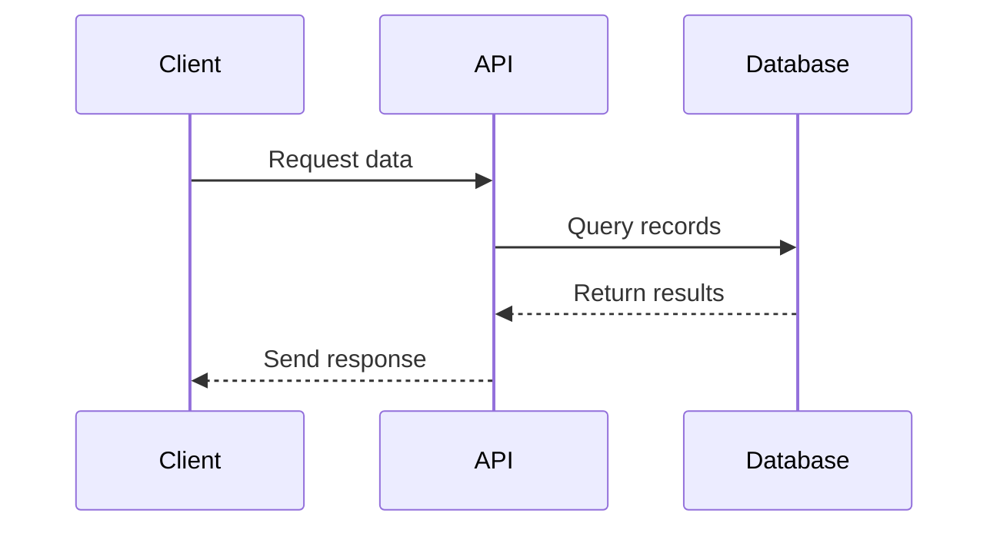
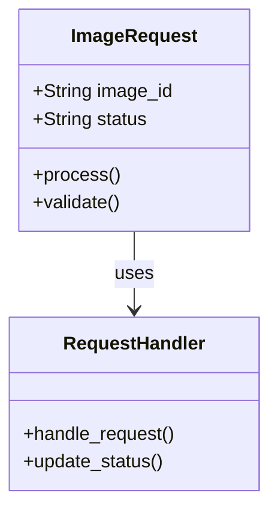
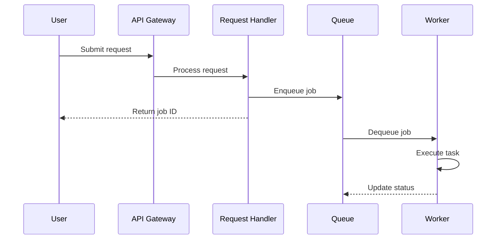

# Design Document Guidelines

## Diagram Requirements

When creating design documents (especially in `.kiro/specs/*/design.md` files), use **Mermaid syntax** for all diagrams to ensure they are version-controllable, readable in markdown, and easily maintainable.

### Supported Diagram Types

#### Sequence Diagrams

Use Mermaid sequence diagrams to illustrate interactions between components, services, or actors over time.

**Example:**



#### Class Diagrams

Use Mermaid class diagrams to show the structure of classes, their attributes, methods, and relationships.

**Example:**



#### Other Useful Diagram Types

- **Flowcharts**: For decision trees and process flows
- **State Diagrams**: For state machines and lifecycle management
- **Entity Relationship Diagrams**: For data models and database schemas

### Mermaid Syntax Resources

- [Mermaid Documentation](https://mermaid.js.org/)
- [Sequence Diagram Syntax](https://mermaid.js.org/syntax/sequenceDiagram.html)
- [Class Diagram Syntax](https://mermaid.js.org/syntax/classDiagram.html)

### Best Practices

1. **Keep diagrams focused**: Each diagram should illustrate one concept or interaction clearly
2. **Use descriptive labels**: Make participant names and method names self-explanatory
3. **Add notes when needed**: Use Mermaid's note syntax to clarify complex interactions
4. **Maintain consistency**: Use similar naming conventions across all diagrams in a spec
5. **Test rendering**: Ensure diagrams render correctly in markdown preview

### When to Use Diagrams

Include diagrams in design documents when they help clarify:

- **Architecture section**: High-level component interactions and system structure
- **Components and Interfaces section**: Class relationships and API contracts
- **Data Models section**: Entity relationships and data flow
- **Error Handling section**: Error propagation and recovery flows
- **Complex workflows**: Multi-step processes that benefit from visual representation

### Example Integration in Design Document

```markdown
## Architecture

The system follows a request-response pattern with asynchronous processing:



The architecture ensures scalability by decoupling request submission from processing.
```

## Why Mermaid?

- **Version Control Friendly**: Text-based diagrams can be diffed and reviewed in pull requests
- **No External Tools Required**: Renders directly in GitHub, GitLab, and most markdown viewers
- **Easy to Update**: Modify diagrams by editing text rather than using graphical tools
- **Consistent Styling**: Automatic formatting ensures visual consistency
- **Accessible**: Can be read as text even without rendering

## Alternative: ASCII Diagrams

For very simple diagrams, ASCII art is acceptable but Mermaid is strongly preferred for anything beyond basic illustrations.
