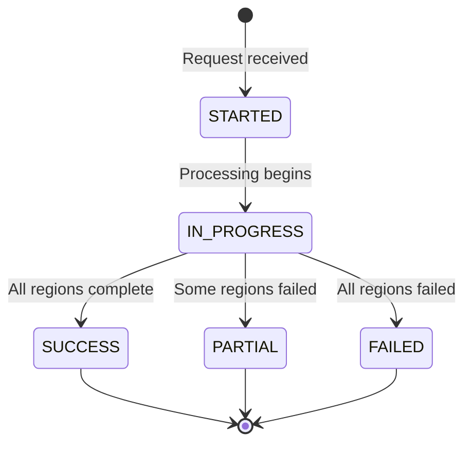

# ModelRunner API

This guide describes the public API for submitting image processing requests to the OversightML ModelRunner and the status notifications it produces.

## Image Processing Requests

Image processing jobs are started by placing an ImageRequest message on the ImageRequestQueue (SQS). These requests define the imagery to be processed, what models to use, and where the results should be sent.

### Sample Request

```json
{
    "jobName": "<job_name>",
    "jobId": "<job_id>",
    "imageUrls": ["<image_url>"],
    "outputs": [
        {"type": "S3", "bucket": "<result_bucket_name>", "prefix": "<job_name>/"},
        {"type": "Kinesis", "stream": "<result_stream_name>", "batchSize": 1000}
    ],
    "imageProcessor": {"name": "<sagemaker_endpoint>", "type": "SM_ENDPOINT"},
    "imageProcessorParameters": {"TargetVariant": "AllTraffic"},
    "imageProcessorTileSize": 2048,
    "imageProcessorTileOverlap": 50,
    "imageProcessorTileFormat": "NITF",
    "imageProcessorTileCompression": "NONE"
}
```

### Request Parameters

| Parameter | Type | Required | Description |
|:----------|:-----|:--------:|:------------|
| `jobId` | string | Yes | Unique identifier for the job (e.g., `testId1`) |
| `jobName` | string | No | Human-readable name for the job (e.g., `jobtest-testId1`) |
| `imageUrls` | list[string] | Yes | List of S3 image paths to process (e.g., `s3://test-images-0123456789/tile.tif`) |
| `outputs` | list[object] | Yes | Output destinations for results (see [Output Configuration](#output-configuration)) |
| `imageProcessor` | object | Yes | Model endpoint configuration (see [Image Processor Configuration](#image-processor-configuration)) |
| `imageProcessorParameters` | object | No | Additional parameters passed to the model endpoint (see [Endpoint Parameters](#endpoint-parameters)) |
| `imageProcessorTileSize` | integer | No | Tile dimensions in pixels (default: 1024). Represents both width and height |
| `imageProcessorTileOverlap` | integer | No | Overlap between tiles in pixels (default: 50) |
| `imageProcessorTileFormat` | string | No | Tile format: `NITF`, `JPEG`, `PNG`, or `GTIFF` (default: `NITF`) |
| `imageProcessorTileCompression` | string | No | Compression: `NONE`, `JPEG`, `J2K`, or `LZW` (default: `NONE`) |
| `imageReadRole` | string | No | IAM role ARN for cross-account image access |
| `regionOfInterest` | string | No | WKT geometry string defining the area to process |
| `featureProperties` | list[object] | No | Additional properties to include in output features |
| `postProcessing` | list[object] | No | Post-processing configuration (see [Post Processing](#post-processing)) |

### Output Configuration

Results can be written to S3 buckets and/or Kinesis streams. Multiple outputs can be specified.

**S3 Output:**
```json
{"type": "S3", "bucket": "<bucket_name>", "prefix": "<output_prefix>/"}
```

**Kinesis Output:**
```json
{"type": "Kinesis", "stream": "<stream_name>", "batchSize": 1000}
```

### Image Processor Configuration

The `imageProcessor` object specifies which model endpoint to use:

```json
{"name": "<endpoint_name>", "type": "<SM_ENDPOINT | HTTP_ENDPOINT>", "assumedRole": "<role_arn>"}
```

| Field | Description |
|:------|:------------|
| `name` | The SageMaker endpoint name or HTTP endpoint URL |
| `type` | `SM_ENDPOINT` for SageMaker endpoints, `HTTP_ENDPOINT` for HTTP-based endpoints |
| `assumedRole` | Optional IAM role ARN for cross-account endpoint invocation |

### Endpoint Parameters

The `imageProcessorParameters` object allows you to pass additional parameters to the model endpoint. For SageMaker endpoints, these parameters are passed directly to the [InvokeEndpoint](https://docs.aws.amazon.com/sagemaker/latest/APIReference/API_runtime_InvokeEndpoint.html) API call.

**Supported SageMaker Parameters:**

| Parameter | Description |
|:----------|:------------|
| `ContentType` | MIME type of the input data |
| `Accept` | Desired MIME type of the inference response |
| `CustomAttributes` | Custom attributes for the request (max 1024 characters) |
| `TargetModel` | Target model for multi-model endpoints |
| `TargetVariant` | Target variant for endpoints with multiple production variants |
| `TargetContainerHostname` | Target container for multi-container endpoints |
| `InferenceId` | Identifier for tracking inference requests |
| `EnableExplanations` | Enable model explainability (if supported) |
| `InferenceComponentName` | Inference component name for endpoints with inference components |
| `SessionId` | Session identifier for stateful inference |

For complete parameter documentation, see the [SageMaker InvokeEndpoint API Reference](https://docs.aws.amazon.com/sagemaker/latest/APIReference/API_runtime_InvokeEndpoint.html).

**Example - Multi-Variant Endpoint:**
```json
{
    "imageProcessorParameters": {
        "TargetVariant": "production-v2"
    }
}
```

**Example - Multi-Container Endpoint:**
```json
{
    "imageProcessorParameters": {
        "TargetContainerHostname": "aircraft-detector"
    }
}
```

### Post Processing

The `postProcessing` field configures how ModelRunner handles features detected in tile overlap regions. Available algorithms:

| Algorithm | Description |
|:----------|:------------|
| `NMS` | Non-Maximal Suppression - drops duplicate features in overlap regions |
| `SOFT_NMS` | Soft NMS - decays detection scores instead of dropping duplicates |

```json
{
    "postProcessing": [{
        "step": "FEATURE_DISTILLATION",
        "algorithm": {
            "algorithmType": "NMS",
            "iouThreshold": 0.5,
            "skipBoxThreshold": 0.1
        }
    }]
}
```

## Status Notifications

ModelRunner publishes status updates to an SNS topic as image processing jobs progress. Subscribe to this topic to receive real-time notifications about job status.

### Status Message Format

Status messages are published with both a human-readable message body and structured message attributes for filtering.

**Message Body:**
```
StatusMonitor update: <status> <job_id>: <description>
```

**Message Attributes:**

| Attribute | Type | Description |
|:----------|:-----|:------------|
| `status` | string | Current status of the request |
| `job_id` | string | Unique identifier for the job |
| `image_id` | string | Identifier for the specific image being processed |
| `image_status` | string | Status specific to image processing |
| `region_id` | string | Identifier for the region (for region-level updates) |
| `processing_duration` | string | Processing time in milliseconds |
| `failed_tiles` | string | List of tile coordinates that failed (if applicable) |

### Status Values

| Status | Description |
|:-------|:------------|
| `STARTED` | Job has been received and validated |
| `IN_PROGRESS` | Image processing is underway |
| `SUCCESS` | All regions processed successfully |
| `PARTIAL` | Some regions succeeded, some failed |
| `FAILED` | All regions failed to process |

### Subscribing to Status Updates

You can filter SNS subscriptions based on message attributes to receive only specific status updates:

**Example - Subscribe to failures only:**
```json
{
    "status": ["FAILED", "PARTIAL"]
}
```

**Example - Subscribe to specific job:**
```json
{
    "job_id": ["my-job-id-123"]
}
```

### Status Flow


