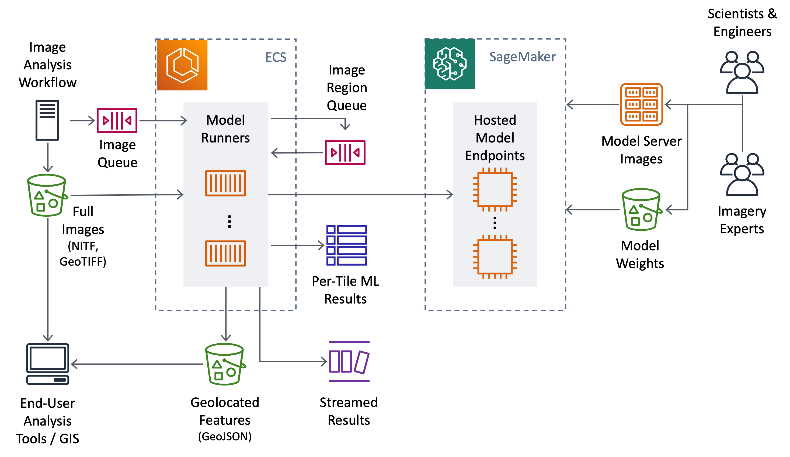

# OversightML Model Runner


The OversightML ModelRunner is an application that extracts geospatial features from satellite imagery using ML
models hosted by SageMaker AI. The application monitors an input queue for processing requests, decomposes the
image into tiles, invokes the ML model endpoint with each tile, and finally aggregates all the results into a
set of geolocated features. The application itself has been containerized and is designed to run on a
distributed cluster of machines so you can scale to large enterprise workloads.



## Installation
Fully automated example of deploying this application on AWS has been provided in the `cdk/` directory. See
[cdk/README.md](./cdk/README.md) for detailed instructions.

## Computer Vision Models
This application is optimized to utilize models hosted using
[SageMaker AI Real-Time Endpoints](https://docs.aws.amazon.com/sagemaker/latest/dg/realtime-endpoints.html). It supports single-model endpoints, multi-container endpoints, and endpoints with multiple variants. Each container supports a standard HTTP interface where it receive image tiles and responds with the features created by the model. The [Guidance for Model Developers](./GUIDE_FOR_MODEL_DEVELOPERS.md) document contains details of how the OversightML ModelRunner applications interacts with containerized computer vision (CV) models and examples of the GeoJSON results it expects and generates.

Example implementations of these interfaces can be found in the `src/aws/osml/test_models` directory or in the [osml-models](https://github.com/awslabs/osml-models) repository.

## Running Jobs

ModelRunner is designed to be integrated into your existing time-sensitive image processing workflows. Image processing
jobs are started by placing an ImageRequest on the ImageRequestQueue. These image requests define the imagery to be processed,
what models to use, and where the results should be sent.

Sample ImageRequest:

```json
{
    "jobName": "<job_name>",
    "jobId": "<job_id>",
    "imageUrls": ["<image_url>"],
    "outputs": [
        {"type": "S3", "bucket": "<result_bucket_arn>", "prefix": "<job_name>/"},
        {"type": "Kinesis", "stream": "<result_stream_arn>", "batchSize": 1000}
    ],
    "imageProcessor": {"name": "<sagemaker_endpoint>", "type": "SM_ENDPOINT"},
    "imageProcessorParameters": {"TargetVariant": "AllTraffic"},
    "imageProcessorTileSize": 2048,
    "imageProcessorTileOverlap": 50,
    "imageProcessorTileFormat": "< NITF | JPEG | PNG | GTIFF >",
    "imageProcessorTileCompression": "< NONE | JPEG | J2K | LZW >"
}
```

For detailed documentation of all request parameters, endpoint options, and status notifications, see the [ModelRunner API Guide](./MODELRUNNER_API.md).

## Scheduling and Throttling

The OversightML ModelRunner receives processing requests from an input queue and internally balances them across the
model endpoints to improve throughput and utilization. The application monitors the load on each endpoint and can
self throttle jobs to avoid overload. Additional details are available in the [SCHEDULING_AND_THROTTLING.md](./SCHEDULING_AND_THROTTLING.md)
guide.

## Metrics and Logs

As the application runs key performance metrics and detailed logging information are output to [CloudWatch](https://aws.amazon.com/cloudwatch/).
A detailed description of what information is tracked along with example dashboards can be found in
[METRICS_AND_DASHBOARDS.md](./METRICS_AND_DASHBOARDS.md).

## Support & Feedback

To post feedback, submit feature ideas, or report bugs, please use the [Issues](https://github.com/aws-solutions-library-samples/osml-model-runner/issues) section of this GitHub repo.

## Contributing

This project welcomes contributions and suggestions. If you would like to submit a pull request, see our
[Contribution Guide](CONTRIBUTING.md) for more information. We kindly ask that you **do not** open a public GitHub issue to report security concerns. Instead follow reporting mechanisims described in [SECURITY](SECURITY.md).

## License

This library is licensed under the Apache 2.0 License. See the [LICENSE](LICENSE) file.
