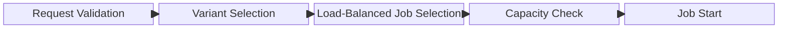

# Scheduling and Throttling

This guide is intended for operators and advanced users who deploy ModelRunner and need to understand how image jobs are scheduled, throttled, and monitored.

The OversightML ModelRunner has a scheduler that controls the start of new image jobs. The scheduler compares available endpoint capacity to estimated image load before starting new work. This allows ModelRunner to protect endpoints with fixed compute allocations or during burst events that exceed an exndpoints ability to autoscale.

Without capacity-based scheduling, a large number of image requests can overwhelm individual model endpoints. This can result in increased latency and compute resources wasted on retries. Our goal is to ensure predictable processing times, stable endpoint performance, and efficient resource utilization by only starting jobs when sufficient capacity exists to complete them. This proactive approach complements the reactive retry with exponential backoff protections we use when sending tiles to the endpoints.

## Scheduling Flow

When an image processing request arrives, it flows through several stages before processing begins:



The scheduling process consists of five key stages:

1. **Request Validation**: Requests are pulled from the SQS queue, validated, and stored in DynamoDB for future use. This allows us to fail-fast on any invalid requests and gives the scheduler the ability to look at upcoming jobs to pick the ones targeting endpoints with unused capacity.
2. **Variant Selection**: For multi-variant SageMaker endpoints, if the request did not specify a specific variant a variant will be selected using weighted random selection. This process happens once per image job and ensures that all tiles are processed against a single version of a model.
3. **Load-Balanced Job Selection**: The system evaluates all pending requests and selects the oldest job for the least loaded endpoint. This ensures endpoint resources do not sit idle while blocked by the capacity restrictions of other endpoints.
4. **Capacity Check**: The scheduler compares available endpoint capacity to the estimated load for the selected image. These checks are performed to avoid overloading endpoints beyond their provisioned capacity.
5. **Job Start**: If sufficient capacity exists, the job starts and status is tracked in DynamoDB. Otherwise, it waits while the scheduler moves to evaluate the next eligible request.

### Request Buffering & Validation

When requests are pulled from the SQS queue, the system attempts to read the image header to verify access and determine the image size. If the image cannot be accessed (invalid URL, missing credentials, corrupted file), the request is immediately moved to the dead-letter queue without consuming any processing capacity. This fail-fast approach prevents wasting resources on jobs that will never succeed.

### Variant Selection

SageMaker endpoints support multiple production variants, allowing operators to host different versions of a model behind a single endpoint. This is commonly used for A/B testing new model versions against a current version in production. By distributing traffic across variants using configurable weights, teams can validate that a new model performs as expected before fully rolling it out. This approach is particularly valuable in deployments where service interruption is not acceptable and gradual rollouts are preferred.

For SageMaker endpoints with multiple production variants, the system will select which variant to use before starting an image request. The system uses **weighted random selection** based on the `CurrentWeight` configured for each variant in the SageMaker endpoint. This matches SageMaker's own routing behavior and allows operators to control traffic distribution across variants. For example, if an endpoint has two variants with weights 70 and 30, approximately 70% of the image jobs will be routed to the first variant and 30% to the second variant.

Variant selection happens before capacity evaluation and scheduling decisions are made. This ensures capacity calculations accurate for the specific variant being used.

If an image request explicitly specifies a `TargetVariant`, that variant is always honored and no selection occurs. This allows users to direct requests to specific variants when needed for testing, comparison, or other operational requirements. For endpoints with only one production variant, this selection step is skipped entirely and the single variant is used automatically.

### Load-Balanced Job Selection

Before checking capacity, the scheduler determines which job should be processed next by comparing the current load across endpoints. The system organizes all running jobs by their target endpoint and calculates the load on each one. From the endpoints with the lowest load, the scheduler selects the oldest waiting job that is ready to start. This load-balancing approach ensures that work is distributed fairly across all available endpoints, preventing any single endpoint from becoming a bottleneck while others sit idle.

### Capacity Check

After selecting a candidate job, the scheduler checks to see if an endpoint has enough available capacity to run the job.

#### Available Capacity Calculation

Available capacity represents the remaining concurrent request slots on an endpoint after accounting for currently running jobs. The scheduler calculates this value to determine whether an image can be scheduled:

```
target_capacity = max_endpoint_capacity × capacity_target_percentage
available_capacity = target_capacity - sum_of_current_loads
```

For multi-variant endpoints, capacity is calculated separately for each variant, and only the capacity for the selected variant is considered.

The `max_endpoint_capacity` is determined by endpoint type:

- **SageMaker Serverless**: `MaxConcurrency` configuration value
- **SageMaker Instance-Backed**: `instance_count × instance_concurrency` where instance concurrency is determined by the `osml:instance-concurrency` tag or `DEFAULT_INSTANCE_CONCURRENCY` (default: 2)
- **HTTP Endpoints**: `DEFAULT_HTTP_ENDPOINT_CONCURRENCY` (default: 10)

Example: An instance-backed endpoint with 3 instances and `osml:instance-concurrency=5` has a max capacity of 15 concurrent requests.

The `CAPACITY_TARGET_PERCENTAGE` setting (default: 1.0) allows operators to maintain headroom for autoscaling and burst traffic:

- **< 1.0** (e.g., 0.8): Reserves headroom, useful for triggering autoscaling before hitting hard limits
- **= 1.0**: Uses full endpoint capacity for maximum utilization
- **> 1.0** (e.g., 1.2): Allows over-provisioning in systems with aggressive autoscaling

Example: An endpoint with 100 max capacity and target percentage 0.8 will only schedule jobs up to 80 concurrent requests, leaving 20 requests of headroom.

#### Image Load Estimation

The system estimates how much load an image will place on an endpoint by calculating the number of regions the image will be divided into and the number of concurrent tile workers per instance:

```
estimated_load = number_of_regions × tile_workers_per_instance
```

The number of regions is determined by the image dimensions, region size, tile size, and tile overlap (see [Guide for Model Developers](GUIDE_FOR_MODEL_DEVELOPERS.md) for details). The `TILE_WORKERS_PER_INSTANCE` setting (default: 4) controls how many tiles are processed concurrently per region.

Example: An image divided into 8 regions with 4 tile workers per instance has an estimated load of 32 concurrent requests.

#### Throttling Decision Logic

The scheduler applies the following logic to determine whether to start a job:

**Case 1: Sufficient Capacity Available**
- Condition: `available_capacity >= estimated_load`
- Action: Start the job immediately
- Rationale: The endpoint has enough capacity to handle the image without overloading

**Case 2: Insufficient Capacity, Other Jobs Running**
- Condition: `available_capacity < estimated_load` AND other jobs are currently running on this endpoint
- Action:  Evaluate the next job
- Rationale: Wait for capacity to free up as other jobs complete; prevents overloading the endpoint

**Case 3: Insufficient Capacity, No Other Jobs Running (Single Image Exception)**
- Condition: `available_capacity < estimated_load` AND no other jobs are running on this endpoint
- Action: Start the job anyway
- Rationale: Prevents deadlock situations where a large image would never be processed

The single image exception is a critical safety mechanism that ensures forward progress even when an image's estimated load exceeds the total endpoint capacity. Without this exception, large images could remain in the queue indefinitely, waiting for capacity that will never become available.

## Configuration Options

The following environment variables control scheduling and throttling behavior. The environment variables should be set in the container environment for model runner. Hints describing the endpoints themselves can be set as tags.

| Variable | Default | Description |
|:---------|:-------:|:------------|
| `SCHEDULER_THROTTLING_ENABLED` | `True` | Enable or disable capacity-based throttling |
| `CAPACITY_TARGET_PERCENTAGE` | `1.0` | Target utilization percentage (0.0-1.5) |
| `DEFAULT_INSTANCE_CONCURRENCY` | `2` | Concurrent requests per SageMaker instance (when tag not present) |
| `DEFAULT_HTTP_ENDPOINT_CONCURRENCY` | `10` | Concurrent requests for HTTP endpoints |
| `TILE_WORKERS_PER_INSTANCE` | `4` | Tile workers per ModelRunner instance |

For SageMaker instance-backed endpoints, add the `osml:instance-concurrency` tag to specify how many concurrent requests each instance can handle:

```bash
aws sagemaker add-tags \
  --resource-arn <endpoint-arn> \
  --tags Key=osml:instance-concurrency,Value=2
```

This value should match your model's actual concurrency capabilities. Test your model under load to determine the optimal value.

## Monitoring

### CloudWatch Metrics

The scheduler emits metrics in the `OSML/ModelRunner` namespace using the standard metric structure described in [Metrics and Dashboards](METRICS_AND_DASHBOARDS.md). These metrics use `Operation=Scheduling` as a dimension and complement the standard SageMaker endpoint metrics (like `Invocations`, `ModelLatency`, and `OverheadLatency`) by showing why jobs may be delayed before they reach the endpoint.

| Metric | Dimension | Description |
|:-------|:----------|:------------|
| `Throttles` | `Operation=Scheduling` | Number of images delayed due to insufficient capacity |
| `Utilization` | `Operation=Scheduling` | Current endpoint utilization percentage (0-100%) |
| `Duration` | `Operation=Scheduling` | Time taken to make scheduling decisions |
| `Errors` | `Operation=Scheduling` | Failures during capacity queries or image access |
| `Invocations` | `Operation=Scheduling` | Number of scheduling decisions made |

Additional scheduling-specific metrics track buffered requests:

| Metric | Dimension | Description |
|:-------|:----------|:------------|
| `ApproximateNumberOfRequestsBuffered` | `Operation=Scheduling` | Total number of requests pulled from SQS not complete |
| `ApproximateNumberOfRequestsVisible` | `Operation=Scheduling` | Total number of requests waiting to be processed |

### Recommended Alarms

Consider setting up CloudWatch alarms for:

- **High throttling rate**: `Throttles` with `Operation=Scheduling` > 50% of total requests
- **Scheduling errors**: `Errors` with `Operation=Scheduling` > 1% error rate
- **Slow scheduling**: `Duration` with `Operation=Scheduling` p99 > 2s

## Best Practices

### Tuning Capacity Target Percentage

Start with the default value of 1.0 and adjust based on observed behavior:

1. **Monitor throttling rate**: If images are frequently throttled but endpoints have capacity, increase the target percentage
2. **Monitor endpoint latency**: If endpoint latency increases during peak load, decrease the target percentage to maintain headroom
3. **Consider autoscaling**: If using autoscaling, set target percentage to 0.8-0.9 to trigger scaling before hitting limits

### Testing Throttling Behavior

To test throttling in a development environment:
1. Set `CAPACITY_TARGET_PERCENTAGE=0.5` to artificially constrain capacity
2. Submit multiple large images simultaneously
3. Monitor `Throttles` and `Utilization` metrics with `Operation=Scheduling` dimension
4. Verify images are throttled and then processed as capacity becomes available

## Troubleshooting

### Images Not Being Scheduled

**Symptom**: Images remain in the queue without being processed, or images are unexpectedly moved to the dead-letter queue

**Possible Causes**:
1. **Insufficient capacity**: Check `Utilization` metric with `Operation=Scheduling` dimension
   - Solution: Increase endpoint capacity or reduce `CAPACITY_TARGET_PERCENTAGE`
2. **Scheduling errors**: Check `Errors` metric with `Operation=Scheduling` dimension. This metric captures both image access failures and SageMaker API errors:
   - Image access errors (invalid URL, missing credentials, corrupted file) cause jobs to move to the dead-letter queue immediately
   - SageMaker API errors (endpoint not found, permission issues) cause the scheduler to fall back to default capacity values
   - Solution: Verify image URLs, IAM role permissions, and that SageMaker endpoints exist and are in service

### High Throttling Rate

**Symptom**: Many images delayed, `Throttles` metric with `Operation=Scheduling` dimension is high

**Possible Causes**:
1. **Endpoint under-provisioned**: Not enough capacity for workload
   - Solution: Increase endpoint instance count or use autoscaling
2. **Target percentage too conservative**: Leaving too much headroom
   - Solution: Increase `CAPACITY_TARGET_PERCENTAGE` toward 1.0

### Endpoint Overload Despite Throttling

**Symptom**: Endpoint latency high, throttling enabled

**Possible Causes**:
1. **Incorrect instance concurrency**: Tag value doesn't match actual capacity
   - Solution: Update `osml:instance-concurrency` tag or `DEFAULT_INSTANCE_CONCURRENCY`
2. **External traffic**: Other applications using the same endpoint
   - Solution: Use dedicated endpoints or account for external load

### Slow Scheduling Decisions

**Symptom**: `Duration` metric with `Operation=Scheduling` dimension is high

**Possible Causes**:
1. **SageMaker API latency**: Endpoint metadata queries are slow
   - Solution: Verify network connectivity, check AWS service health
2. **Image header reads**: Image metadata operations are slow
   - Solution: Verify image storage performance and any GDAL configuration options that might affect S3 read performance.
