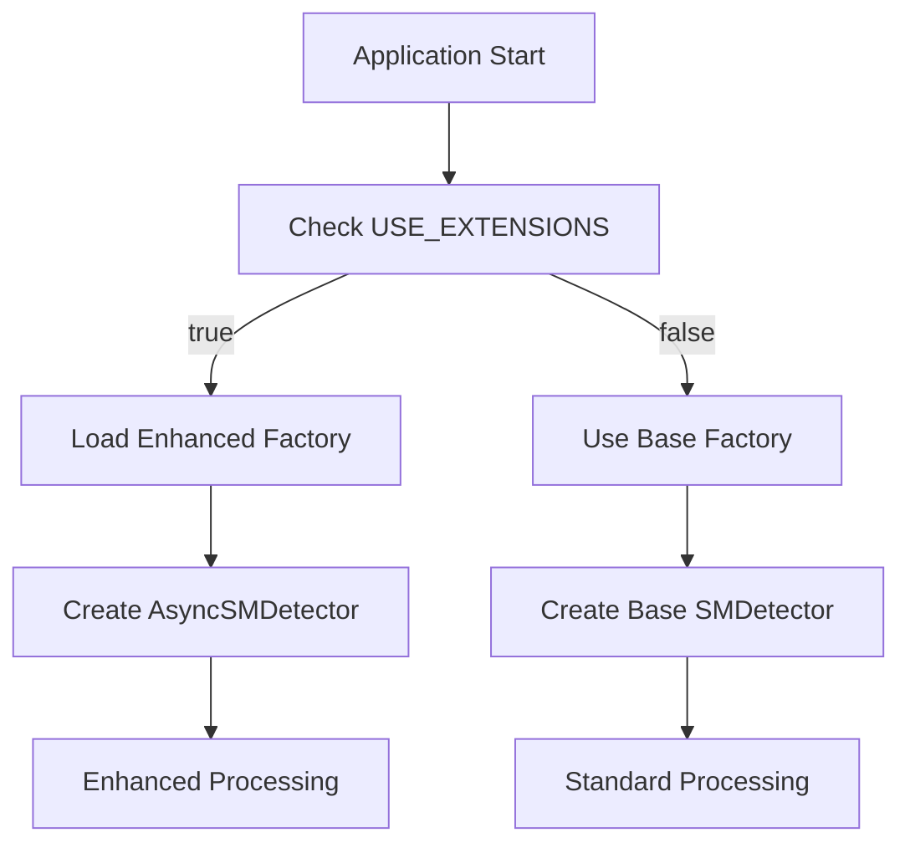

# OSML Model Runner Extensions

This package provides extensions for the OSML Model Runner that enhance functionality while maintaining full compatibility with the base open source package.

## Overview

The extension architecture uses simple inheritance-based patterns to extend the base model runner functionality without modifying the original source code. This approach provides:

- **Clean Separation**: Extensions are separate from the base package
- **Easy Maintenance**: Upstream updates can be integrated without conflicts
- **Graceful Fallback**: Automatic fallback to base functionality if extensions fail
- **Environment Control**: Extensions can be enabled/disabled via environment variables

## Architecture

### Extension Components (Examples)

1. **AsyncSMDetector**: Enhanced SageMaker detector with preprocessing and postprocessing capabilities
2. **AsyncSMDetectorBuilder**: Builder for creating AsyncSMDetector instances
3. **EnhancedFeatureDetectorFactory**: Factory that chooses between base and extended implementations


### How It Works



## Installation

The extensions are automatically installed when building the Docker container:

```dockerfile
# Install base model-runner package
RUN python3 -m pip install osml-model-runner/.

# Install extensions as separate package
COPY extensions/ /home/extensions/
RUN python3 -m pip install /home/extensions/
```

## Configuration

Extensions are configured through environment variables:

### Environment Variables

| Variable | Default | Description |
|----------|---------|-------------|
| `USE_EXTENSIONS` | `true` | Enable/disable extensions |

The extension system is designed to be simple - just set `USE_EXTENSIONS=true` to enable the AsyncSMDetector, or `USE_EXTENSIONS=false` to use the base SMDetector.

## Programming Interface

### Using Extensions in Code

```python
from osml_extensions import EnhancedFeatureDetectorFactory
from aws.osml.model_runner.api import ModelInvokeMode

# Create factory with extensions
factory = EnhancedFeatureDetectorFactory(
    endpoint="my-sagemaker-endpoint",
    endpoint_mode=ModelInvokeMode.SM_ENDPOINT,
    use_extensions=True  # or omit to use USE_EXTENSIONS env var
)

# Build detector (will be AsyncSMDetector if extensions enabled)
detector = factory.build()

# Use detector normally
features = detector.find_features(payload, metrics)
```

### Graceful Fallback

The extension system provides multiple levels of fallback:

1. **Import Fallback**: Missing extensions fall back to base implementations
2. **Runtime Fallback**: Extension failures fall back to base functionality
3. **Factory Fallback**: Enhanced factory falls back to base factory


### Adding New Extensions

1. Create new detector class inheriting from base detector
2. Create corresponding builder class
3. Update the enhanced factory to support the new detector
4. Add tests for the new components
5. Update documentation

### Example: Custom Detector

```python
from aws.osml.model_runner.inference.detector import Detector
from osml_extensions.detectors.async_sm_detector import AsyncSMDetector

class CustomDetector(AsyncSMDetector):
    def _preprocess_payload(self, payload):
        # Custom preprocessing logic
        return super()._preprocess_payload(payload)
    
    def _postprocess_features(self, features):
        # Custom postprocessing logic
        enhanced_features = super()._postprocess_features(features)
        # Add custom enhancements
        return enhanced_features
```

## Troubleshooting

### Common Issues

#### Extensions Not Loading

**Problem**: Extensions are enabled but base functionality is being used.

**Solutions**:
1. Check that `USE_EXTENSIONS=true` is set
2. Verify extensions package is installed: `pip list | grep osml-extensions`
3. Check logs for import errors
4. Verify Python path includes extension modules

#### Import Errors

**Problem**: `ImportError` when trying to use extensions.

**Solutions**:
1. Ensure extensions package is installed in the same environment
2. Check Python path and module locations
3. Verify all dependencies are installed
4. Try importing components individually to isolate the issue
