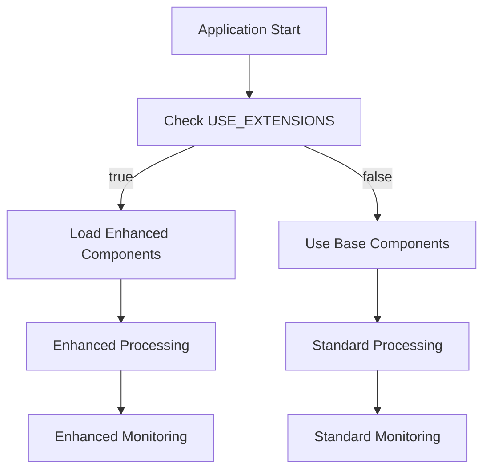

# OSML Model Runner Extensions

This package provides extensions for the OSML Model Runner that enhance functionality while maintaining full compatibility with the base open source package.

## Overview

The extension architecture uses clean inheritance-based patterns to extend the base model runner functionality without modifying the original source code. This approach provides:

- **Clean Separation**: Extensions are separate from the base package
- **Easy Maintenance**: Upstream updates can be integrated without conflicts
- **Graceful Fallback**: Automatic fallback to base functionality if extensions fail
- **Environment Control**: Extensions can be enabled/disabled via environment variables

## Architecture

### Extension Components

1. **EnhancedFeatureDetectorFactory**: Factory that chooses between base and extended detector implementations
2. **AsyncSMDetector**: Enhanced SageMaker detector with preprocessing and postprocessing capabilities
3. **EnhancedTileWorker**: Enhanced tile worker with improved processing and monitoring
4. **EnhancedRegionRequestHandler**: Enhanced region handler with integrated dependencies
5. **EnhancedModelRunner**: Model runner with dependency injection support

### How It Works



## Installation

### From Source

```bash
# Clone the repository
git clone <repository-url>
cd osml-model-runner-extensions

# Install in development mode
pip install -e .

# Or install with development dependencies
pip install -e ".[dev]"
```

### From Package

```bash
pip install osml-model-runner-extensions
```

## Configuration

Extensions are configured through environment variables:

### Environment Variables

| Variable | Default | Description |
|----------|---------|-------------|
| `USE_EXTENSIONS` | `false` | Enable/disable extensions |
| `ASYNC_DETECTOR_ENABLED` | `true` | Enable AsyncSMDetector when extensions are on |
| `ENHANCED_MONITORING_ENABLED` | `true` | Enable enhanced monitoring features |
| `EXTENSION_FALLBACK_ENABLED` | `true` | Enable fallback to base components on error |
| `EXTENSION_MAX_RETRY_ATTEMPTS` | `3` | Maximum retry attempts for failed operations |
| `EXTENSION_RETRY_DELAY_SECONDS` | `1.0` | Delay between retry attempts |
| `EXTENSION_PERFORMANCE_MONITORING_ENABLED` | `true` | Enable performance monitoring |
| `EXTENSION_DEBUG_LOGGING_ENABLED` | `false` | Enable debug logging |

### Boolean Value Formats

Boolean environment variables accept the following values:
- True: "true", "1", "yes", "on" (case-insensitive)
- False: "false", "0", "no", "off" (case-insensitive)

## Usage

### Basic Usage

```python
from osml_extensions import EnhancedModelRunner

# Create enhanced model runner with default configuration
runner = EnhancedModelRunner()

# Start processing
runner.run()
```

### Custom Configuration

```python
from osml_extensions import (
    EnhancedModelRunner,
    EnhancedFeatureDetectorFactory,
    EnhancedRegionRequestHandler,
    EnhancedTileWorker
)

# Create model runner with custom components
runner = EnhancedModelRunner(
    factory_class=EnhancedFeatureDetectorFactory,
    region_handler_class=EnhancedRegionRequestHandler,
    tile_worker_class=EnhancedTileWorker
)

runner.run()
```

### Using Individual Components

```python
from osml_extensions import EnhancedFeatureDetectorFactory, ExtendedModelInvokeMode
from aws.osml.model_runner.api import ModelInvokeMode

# Create enhanced factory
factory = EnhancedFeatureDetectorFactory(
    endpoint="my-sagemaker-endpoint",
    endpoint_mode=ExtendedModelInvokeMode.SM_ENDPOINT_ASYNC,
    use_extensions=True
)

# Build detector (will be AsyncSMDetector if extensions enabled)
detector = factory.build()

# Use detector normally
features = detector.find_features(payload, metrics)
```

### Configuration Management

```python
from osml_extensions import ExtensionConfig, load_extension_config

# Load configuration from environment
config = load_extension_config()

# Check configuration
if config.use_extensions:
    print("Extensions are enabled")

# Create custom configuration
custom_config = ExtensionConfig(
    use_extensions=True,
    async_detector_enabled=True,
    enhanced_monitoring_enabled=True,
    fallback_on_error=True
)
```

### Logging

```python
from osml_extensions import get_extension_logger, performance_timer, log_context

# Get extension logger
logger = get_extension_logger("my_component", "MyComponent")

# Log with context
logger.info("Processing started", context={"request_id": "12345"})

# Use performance timer
with performance_timer(logger, "my_operation"):
    # Your operation here
    pass

# Use log context manager
with log_context(logger, request_id="12345", user_id="user123"):
    logger.info("Processing request")  # Will include context
```

## Environment Setup Examples

### Enable Extensions with Enhanced Monitoring

```bash
export USE_EXTENSIONS=true
export ENHANCED_MONITORING_ENABLED=true
export EXTENSION_DEBUG_LOGGING_ENABLED=true
```

### Configure Retry Behavior

```bash
export USE_EXTENSIONS=true
export EXTENSION_MAX_RETRY_ATTEMPTS=5
export EXTENSION_RETRY_DELAY_SECONDS=2.5
```

### Disable Extensions (Use Base Functionality)

```bash
export USE_EXTENSIONS=false
```

## Docker Integration

The extensions can be integrated into Docker containers:

```dockerfile
# Install base model-runner package
RUN python3 -m pip install osml-model-runner

# Install extensions
COPY osml-model-runner-extensions/ /tmp/extensions/
RUN python3 -m pip install /tmp/extensions/

# Set environment variables
ENV USE_EXTENSIONS=true
ENV ENHANCED_MONITORING_ENABLED=true
```

## Development

### Setting Up Development Environment

```bash
# Clone repository
git clone <repository-url>
cd osml-model-runner-extensions

# Create virtual environment
python -m venv venv
source venv/bin/activate  # On Windows: venv\Scripts\activate

# Install in development mode with all dependencies
pip install -e ".[dev,test]"

# Install pre-commit hooks
pre-commit install
```

### Running Tests

```bash
# Run all tests
pytest

# Run with coverage
pytest --cov=osml_extensions --cov-report=html

# Run specific test file
pytest tests/test_enhanced_factory.py

# Run with verbose output
pytest -v
```

### Code Quality

```bash
# Format code
black src/ tests/

# Lint code
flake8 src/ tests/

# Type checking
mypy src/
```

## Troubleshooting

### Common Issues

#### Extensions Not Loading

**Problem**: Extensions are enabled but base functionality is being used.

**Solutions**:
1. Check that `USE_EXTENSIONS=true` is set
2. Verify extensions package is installed: `pip list | grep osml-extensions`
3. Check logs for import errors
4. Verify Python path includes extension modules

#### Import Errors

**Problem**: `ImportError` when trying to use extensions.

**Solutions**:
1. Ensure extensions package is installed in the same environment
2. Check Python path and module locations
3. Verify all dependencies are installed
4. Try importing components individually to isolate the issue

#### Configuration Issues

**Problem**: Extensions not behaving as expected.

**Solutions**:
1. Validate environment variables: `python -c "from osml_extensions.config import validate_environment_variables; print(validate_environment_variables())"`
2. Check configuration summary: `python -c "from osml_extensions.config import get_config_summary; print(get_config_summary())"`
3. Enable debug logging: `export EXTENSION_DEBUG_LOGGING_ENABLED=true`

### Debug Information

```python
# Get configuration summary
from osml_extensions.config import get_config_summary
print(get_config_summary())

# Validate environment variables
from osml_extensions.config import validate_environment_variables
issues = validate_environment_variables()
if issues:
    print("Configuration issues:", issues)
else:
    print("Configuration is valid")

# Get configuration documentation
from osml_extensions.config import create_config_documentation
print(create_config_documentation())
```

## Contributing

1. Fork the repository
2. Create a feature branch
3. Make your changes
4. Add tests for new functionality
5. Ensure all tests pass
6. Submit a pull request

## License

This project is licensed under the MIT License - see the LICENSE file for details.

## Support

For support and questions:
1. Check the troubleshooting section above
2. Review the configuration documentation
3. Enable debug logging for more detailed information
4. Create an issue in the repository with detailed information about your problem
